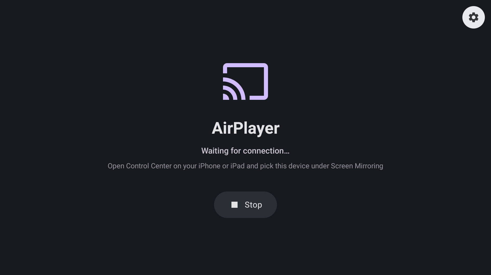
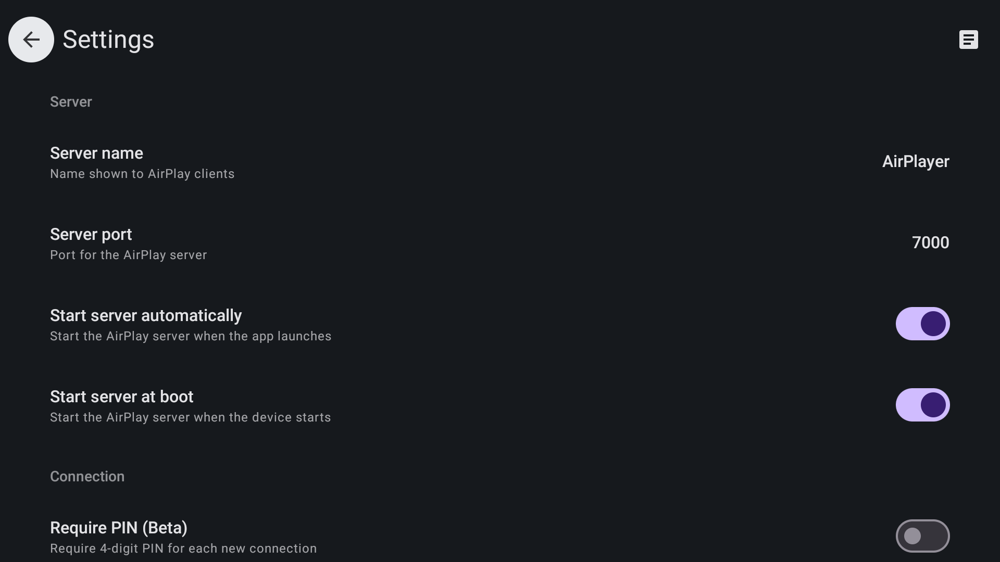
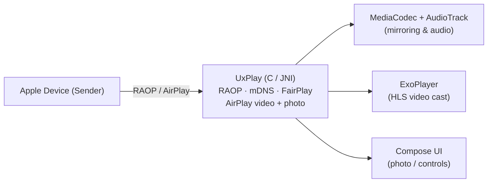

# AirPlayer

[](https://github.com/seancheung/airplayer/blob/main/LICENSE)
[](https://github.com/seancheung/airplayer/actions/workflows/apk.yml)
[](https://github.com/seancheung/airplayer/releases)

A free and open-source **AirPlay receiver for Android**, built for Android TV. AirPlayer turns
your TV (or any Android device) into an AirPlay target for screen mirroring, audio and music
streaming, in-app **video casting** and **photo / slideshow** display.

Based on [UxPlay](https://github.com/FDH2/UxPlay).

<p align="center">
  
  &nbsp;
  
</p>

## Features

- **Screen mirroring** — H.264 and H.265 (HEVC), hardware decoding with a software fallback.
- **Audio & music streaming** — AAC-ELD / AAC-LC / ALAC, with track metadata, cover art,
  transport controls, and Android media-session + notification integration.
- **AirPlay video casting** — plays in-app videos cast from apps, not just their audio. Powered by Media3/ExoPlayer:
  - Direct-URL sources play out of the box.
  - YouTube streams its segments from Google's CDN; an optional **HTTP/SOCKS proxy** lets the
    receiver reach them (loopback is never proxied).
  - Selectable max resolution (1080p / 1440p / 4K / Auto).
- **Photo casting** — displays photos and slideshows from the Photos app, with a crossfade.
- **Android TV UI** — remote / D-pad navigation, dark theme, immersive full-screen playback.
- **Optional PIN authentication.**
- Picture-in-Picture, automatic resolution and audio/video mode switching, auto-start (on app
  launch and on device boot).
- Decoder selection (auto / hardware / software), resolution, overscan, frame-rate and
  audio-latency controls.
- Debug overlay with real-time statistics (FPS, bitrate, codec, resolution, frame count, volume).

> [!WARNING]
> DRM content (e.g. from the Apple TV app, Netflix, Disney+) is not supported.

> [!NOTE]
> YouTube casting requires the receiver to reach `*.googlevideo.com` over HTTPS. On networks
> that block this, configure a proxy under **Settings → Video proxy**.

## Compatibility

- Android 8.0+ (API 26); ABIs `arm64-v8a`, `armeabi-v7a`, `x86_64`.
- Optimized for Android TV (tested on Sony BRAVIA / MediaTek).
- Sender and receiver must be on the same subnet.

## Architecture

The AirPlay / RAOP protocol is handled by the C-based [UxPlay](https://github.com/FDH2/UxPlay)
library through a JNI bridge. Mirroring video and audio are decoded with Android `MediaCodec` /
`AudioTrack`; cast video (HLS) is played by Media3/ExoPlayer; photos are drawn by the Compose UI.



The AirPlay video direct-play and `PUT /photo` additions live on the `android` branch of the
UxPlay fork [seancheung/UxPlay](https://github.com/seancheung/UxPlay), referenced as a submodule.

## Building

Requirements: **JDK 21**, the Android SDK, and **NDK 27.0.12077973**. Native C/C++ components
under [`app/src/main/cpp`](app/src/main/cpp) are built with CMake. Initialize submodules first:

```bash
git submodule update --init --recursive
./gradlew assembleDebug
```

### Release

Pushing a `v*.*.*` tag (or running the **Generate APK** workflow manually) builds a signed
release APK and publishes it to GitHub Releases. Signing expects two repository secrets:

- `STORE` — base64 of your keystore (`base64 -i upload.jks`)
- `LOCAL` — base64 of a `local.properties` containing `storeFile` / `storePassword` /
  `keyAlias` / `keyPassword`

See [`.github/workflows/apk.yml`](.github/workflows/apk.yml).

## Credits

- [UxPlay](https://github.com/FDH2/UxPlay) — AirPlay / RAOP server implementation
- [ALAC](https://github.com/macosforge/alac) — lossless audio decoder

---

Disclaimer: this project is not affiliated with Apple Inc. "AirPlay" is a trademark of Apple Inc.
